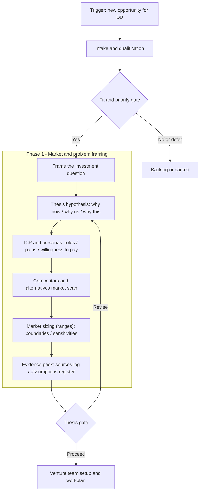
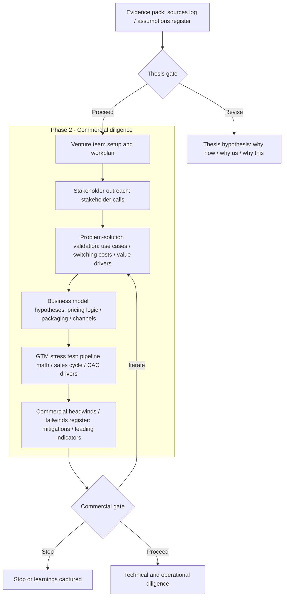
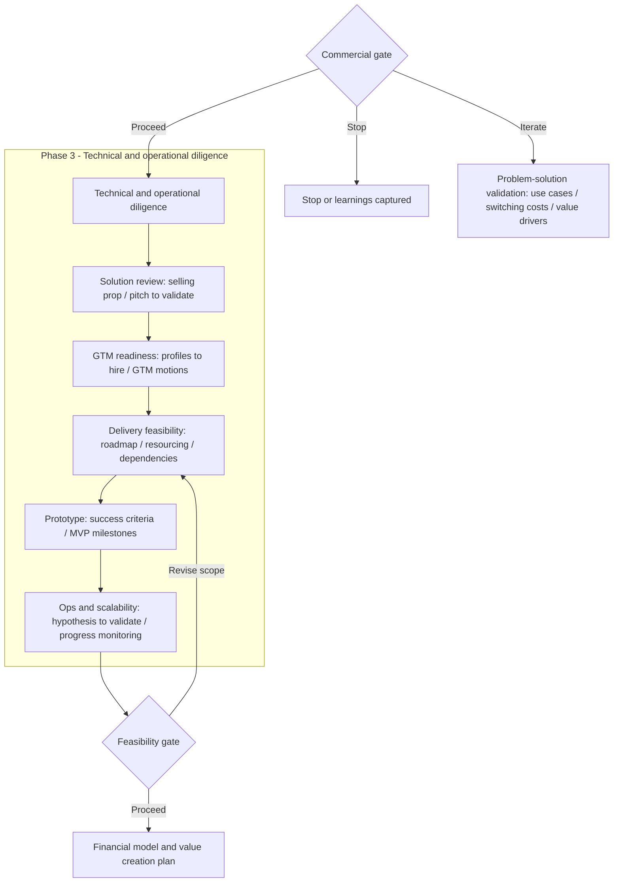
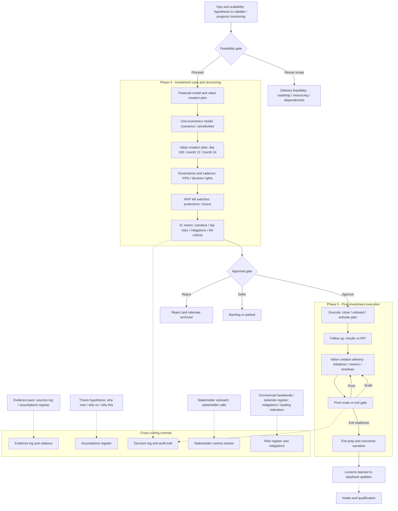

This deep dive shows how we helped a venture studio bring structure to investment diligence*before* any tools, models, or automation.

The goal wasnt to add more process. It was to make decisions:

- **Repeatable** (the same question gets answered the same way)
- **Auditable** (why a decision was made is clear weeks later)
- **Time-boxed** (progress without endless rework)
- **Aligned** (executives and operators share the same definition of good enough)

If you want the full case context, see the parent case study: **[Enabling a Venture Studio to Accelerate Capital Allocations](/work/venture-studio-accelerate-capital/)**.

---

## What we mapped (and why)

In high-velocity venture environments, the failure mode is rarely bad analysis. Its **unclear decision rights, inconsistent evidence standards, and shifting goals** mid-stream.

Decision mapping gave the client a shared operating system for diligence:

- A single end-to-end view of the investment process
- Clear **gates** (what gets decided, by whom, using what evidence)
- Explicit **loops** for revision vs. stop decisions
- Cross-cutting controls (assumptions, evidence, risk, and decision logs)

This is the work that makes later implementation possiblebecause you cannot automate ambiguity.

---

## Why we always start with process, not technology

When executives ask how AI can help them make better decisions, our first response is usually uncomfortable but necessary.

Before discussing models, agents, or automation, we need to understand how decisions are actually made today.

In fast-moving investment environments, most problems do not come from a lack of intelligence or data. They come from unclear decision rights, shifting criteria, and hidden assumptions that only surface when things go wrong.

This deep dive shows how we worked with a venture studio to map their investment decision process end to end, long before introducing any AI workflows. The objective was simple: make the decision process visible, testable, and improvable.

Only then does technology have a place.

If you want the broader engagement context, refer to the parent case study:
[Enabling a Venture Studio to Accelerate Capital Allocations](/work/venture-studio-accelerate-capital/)

---

## How we ran the mapping with the client

We did not arrive with a predefined framework or a theoretical model. Instead, we worked directly from how the client already operated.

Together with the investment and venture teams, we replayed recent deals step by step. We looked at what triggered decisions, what information was used, who influenced outcomes, and where disagreements appeared.

From this work, we structured the process into four clear phases, each with its own purpose, outputs, and decision gates:

1. Market and problem framing  
2. Commercial diligence  
3. Technical and operational diligence  
4. Investment case and structuring  

What follows is a walkthrough of each phase, with concrete examples of how the mapped process was used in practice.

---

## Phase 1. Market and problem framing

Phase 1 is about deciding whether an opportunity deserves serious time and attention.

**What we illustrated in practice**

The client already knew what a strong Phase 1 output looked like. They had examples of good memos and clear conclusions. What they did not have was a shared, explicit path to get there.

We helped them reverse engineer the reasoning step by step. Instead of asking whether AI could generate a market thesis, we mapped how humans actually formed one.

A key insight was around overfitting reasoning. If an AI system is asked to identify customer pain points or willingness to pay, it will always find some. It is complying with the instruction, not validating reality.

That is why simply prompting for answers could not work.

By making each step explicit, such as separating hypotheses from evidence and assumptions from facts, we were able to design a workflow that constrained reasoning rather than amplifying bias. The process map became the guardrail that later prevented AI from confidently producing the wrong answer.

---

## Phase 2. Commercial diligence
Phase 2 tests whether the opportunity can sustain a real business, not just a compelling story.

**What we illustrated in practice**

Much of the input in this phase came from stakeholder interviews. This is where we deliberately hit the boundary between full autonomy and team collaboration.

Interviewing customers, partners, or operators was not delegated to AI. It required experienced interviewers who could probe, challenge, and read context.

AI supported everything around that human work. It helped build stakeholder profiles, identify who to speak to, find contact information, and generate targeted interview guides for each role.

After interviews were conducted, humans provided structured notes back into the system. Only then did AI assist with synthesis, pattern detection, and comparison across interviews.

The mapped process made this handoff explicit. Everyone knew where human judgment was required and where automation could accelerate without distorting reality.

---

## Phase 3. Technical and operational diligence

This phase answers a different question: can this be built and operated in a credible way.

**What we illustrated in practice**

At this stage, trust in the analysis becomes critical. Simple language models tend to summarize and agree. That is not what leadership needs when assessing feasibility and risk.

We introduced structured reasoning and adversarial debate. Instead of producing a single answer, the system was required to challenge assumptions, surface contradictions, and argue alternative interpretations before converging on a conclusion.

This was only possible because the process map defined what a valid challenge looked like and where it should occur. The output was not just a recommendation, but a documented reasoning path that teams could interrogate and trust.

---

## Phase 4. Investment case and structuring

Phase 4 is where leadership commits capital, time, and reputation.

**What we illustrated in practice**

This is where we hit the hard limits of language models.

Unit economics, scenario analysis, and sensitivities require math. Large language models are unreliable at arithmetic and compounding effects, especially under scenario stress.

We combined programmatic financial modeling with reasoning models. Quantitative calculations were handled deterministically. Reasoning models interpreted results, challenged assumptions, and translated implications for decision makers.

Because the process map clearly separated calculation from interpretation, the outputs were both numerically sound and explainable at an executive level.

---

## What the client got out of this

By the end of the mapping exercise, the client had:
A shared, explicit view of how investment decisions are made
Clear gates with defined owners, inputs, and outputs
Fewer debates driven by opinion and more decisions grounded in evidence
Faster cycles without sacrificing rigor
A solid foundation to introduce AI without amplifying existing flaws

Most importantly, leadership gained confidence that decisions could be explained, revisited, and improved over time.

---

## Why process mapping changed everything

Process mapping gave us a deep understanding of how the business actually works. It revealed where reasoning matters, where quantitative rigor matters, and where humans must stay in the loop.

Only after this work did it make sense to design AI workflows that combined reasoning models, adversarial techniques, and quantitative modeling in a way that served the business.

Starting with technology would have missed all of this.

---

## What we did not cover here

This deep dive focused on decision and process design. We intentionally did not cover how we ensured auditability and replayability of the workflows.
TO-DO
Deep dive on auditability, replayability, and decision traceability

---
