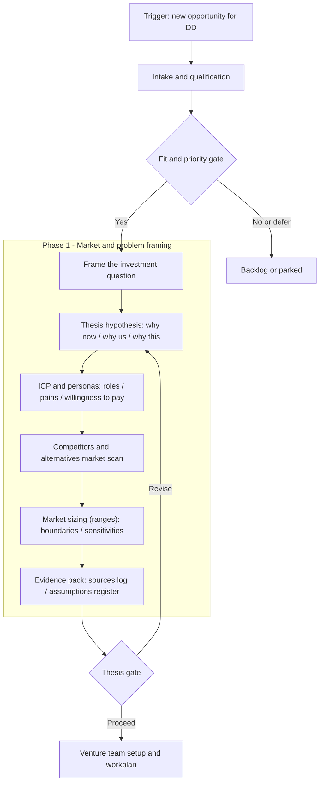
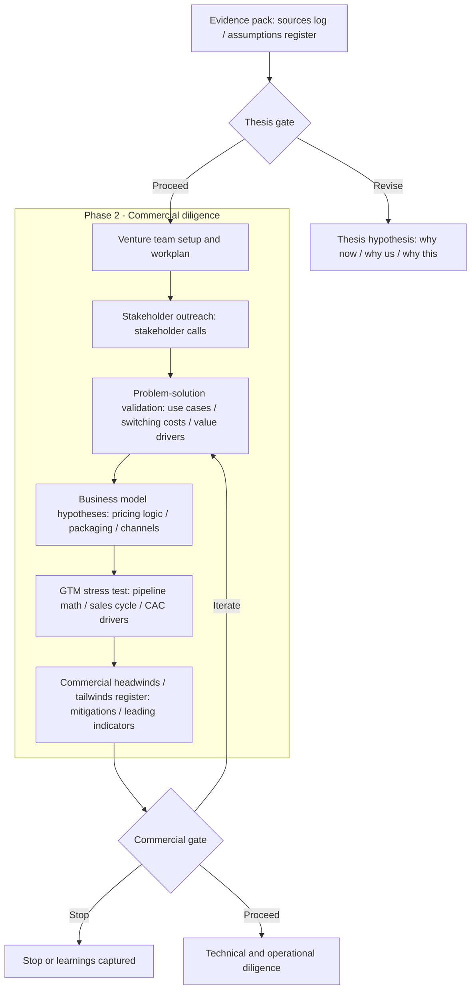
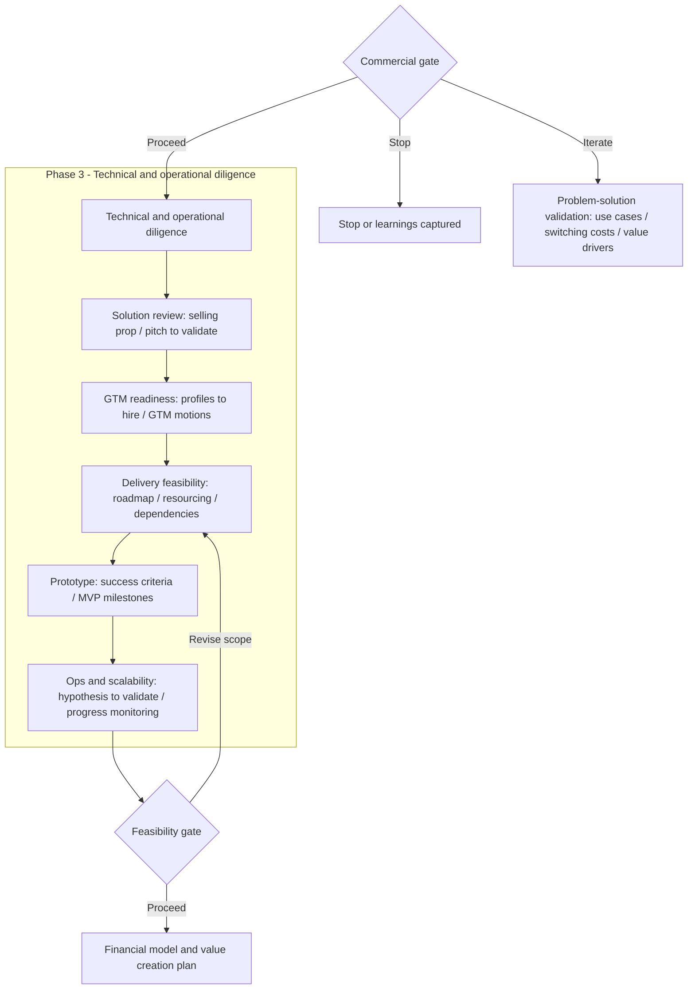
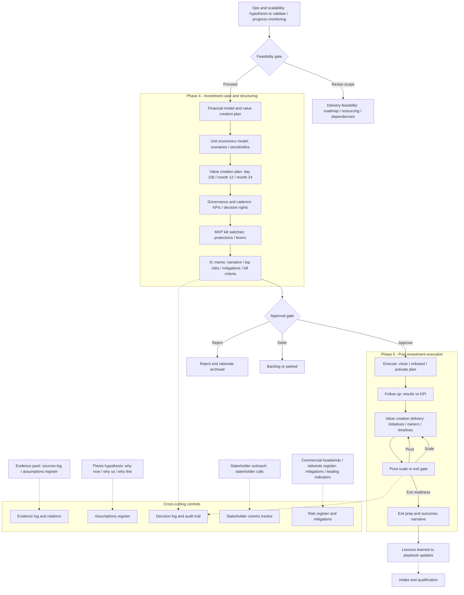

This deep dive shows how we helped a venture studio bring structure to investment diligence*before* any tools, models, or automation.

The goal wasnt to add more process. It was to make decisions:

- **Repeatable** (the same question gets answered the same way)
- **Auditable** (why a decision was made is clear weeks later)
- **Time-boxed** (progress without endless rework)
- **Aligned** (executives and operators share the same definition of good enough)

If you want the full case context, see the parent case study: **[Enabling a Venture Studio to Accelerate Capital Allocations](/work/venture-studio-accelerate-capital/)**.

---

## What we mapped (and why)

In high-velocity venture environments, the failure mode is rarely bad analysis. Its **unclear decision rights, inconsistent evidence standards, and shifting goals** mid-stream.

Decision mapping gave the client a shared operating system for diligence:

- A single end-to-end view of the investment process
- Clear **gates** (what gets decided, by whom, using what evidence)
- Explicit **loops** for revision vs. stop decisions
- Cross-cutting controls (assumptions, evidence, risk, and decision logs)

This is the work that makes later implementation possiblebecause you cannot automate ambiguity.

---

## How we ran the mapping work (methodical, not theoretical)

We ran a structured sequence with the client team:

1. **Decision inventory**: what decisions recur, what triggers them, and what good looks like.
2. **Artifact review**: memos, spreadsheets, IC notes, email threadswhat actually drives a decision in practice.
3. **Stakeholder walkthroughs**: step-by-step replay of recent deals to surface hidden steps and informal criteria.
4. **Gate definition**: convert opinions into **explicit criteria** (minimum evidence, owner, and outputs).
5. **Exception handling**: identify where reality breaks the happy path and define how to respond.
6. **Sign-off and adoption**: align leadership on the map, then translate it into templates and routines.

### Difficulties we had to overcome (and how we handled them)

- **Different meanings of fit.** Teams used the same word to mean different things (strategic fit, founder fit, timeline fit). We introduced a shared vocabulary and broke fit into explicit gates.
- **Inconsistent evidence quality.** Some deals had strong data; others relied on narrative momentum. We defined a minimum evidence pack and an assumptions register to separate facts from beliefs.
- **Decision rights drift.** In fast cycles, decisions were sometimes made by whoever was in the room. We clarified owners per gate and created a decision log so choices had continuity.
- **Time pressure vs. diligence depth.** We designed revision loops and stop rules to prevent sunk-cost escalation while keeping velocity.

---

## Phase 1  Market and problem framing

Phase 1 ensures the team is answering the *right* investment questionbefore diligence expands.

**What this phase changed for leadership:** fewer interesting ideas entering diligence, and more clarity on what needs to be true for a deal to earn time.

---

## Phase 2  Commercial diligence

Phase 2 tests whether the opportunity can become a real businesswithout overbuilding a narrative.

**Where we were strict:** the iterate loop had to result in *new evidence*, not stronger opinions. This prevented the team from re-litigating the same debate.

---

## Phase 3  Technical and operational diligence

This phase turns a promising commercial case into an executable plan, without drifting into premature architecture.

**Exception case we handled explicitly:** when feasibility risk was high but strategic upside was real, we created a scoped learn-fast path (revise scope) instead of forcing an approve/reject decision too early.

---

## Phase 4  Investment case and structuring (with controls that persist post-investment)

Phase 4 is where leadership needs confidence: the case is coherent, the risks are visible, and the execution path is owned.

**Why the controls matter:** the client didnt just need a better decision in the momentthey needed a way to explain decisions internally, learn from them, and improve the system over time.

---

## What leadership got out of this

- **Clarity:** what the process is, where it loops, and what done means at each gate
- **Confidence:** decisions are grounded in an explicit evidence standard and captured rationale
- **Speed without chaos:** time-boxed phases, revision loops, and clear stop criteria
- **A foundation for execution:** the map becomes the reference for templates, routines, and any future tooling

If youd like to see how this mapping work supported the broader engagement, return to the parent case: **[Enabling a Venture Studio to Accelerate Capital Allocations](/work/venture-studio-accelerate-capital/)**.

---

### Note on scope

This page intentionally focuses on **process and decision design**. We avoided detailed technical architecture until the decision criteria and evidence standards were stable.